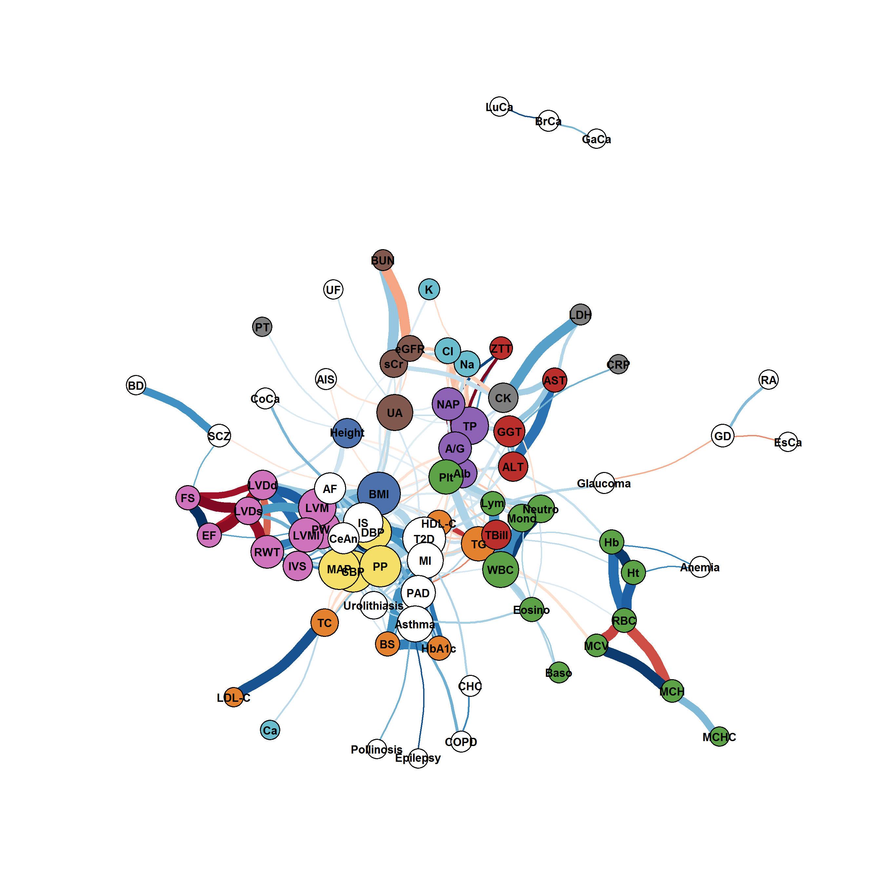
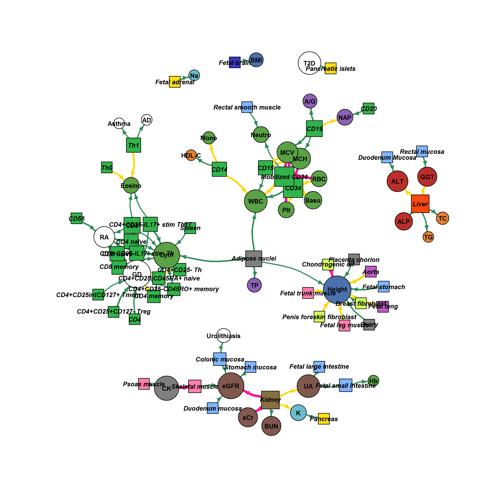

# Network representation of LDSC resuls

## Overview

This repo provides our scripts to plot genetic correlation network (Fig. 3) and cell-type specificity network (Fig. 6) based on bivariate/stratified LD score regression results ([Kanai, M. *et al*., *Nat. Genet.* 2018](http://dx.doi.org/10.1038/s41588-018-0047-6)).


## Requirements

* [R](https://www.r-project.org/) with [igraph](https://github.com/igraph/rigraph), [dplyr](https://github.com/tidyverse/dplyr), [stringr](https://github.com/tidyverse/stringr) and [Hmisc](https://github.com/harrelfe/Hmisc) packages.
  * To install these packages, type `install.packages(c("igraph", "tidyverse", "Hmisc"))` in R console.

## Genetic correlation network (Fig. 3)
Genetic correlation network was designed to visualize cross-phenotype relationships (pairwise genetic correlation matrix) across dozens of traits estimated via [bivariate LD score regression](https://www.nature.com/articles/ng.3406). Each circle represents a trait and each edge represents a significant genetic correlation (FDR < 0.05). Positive and negative genetic correlations are indicated by color. Thicker edges correspond to more significant FDRs.

<p align="center"></p>

### Usage
```{sh}
Rscript plot_network_rg.R input_example/input_rg.txt input_example/traitlist.txt
```

### Input: Genetic correlations (`input_rg.txt`)

This file provides a list of all pairwise genetic correlations estimated via [ldsc](https://github.com/bulik/ldsc) software. The script expects all rows are unique (*i.e.,* one row per each pair of traits). The required fields are as follows:

* `p1_category`: Trait category of trait 1
* `p1`: Trait 1
* `p2_category`: Trait category of trait 2
* `p2`: Trait 2
* `rg`: Genetic correlation
* `p`: P-value
* `q`: FDR q-value


### Input: Trait list (`traitlist.txt`)

This file provides a list of traits and their categories. It defines a color of each category in a figure. The required fields are as follows:

* `CATEGORY`: Trait category
* `TRAIT`: Trait name
* `COLOR`: Category color


### Output
An example output is shown below. Since layouts are determined by the Fruchterman–Reingold algorithm, they are slightly different at each runtime. To get the final figure, we edited a pdf output using Adobe Illustrator.
<p align="center"></p>


## Cell-type specificity network (Fig. 6)
Cell-type specificity network was designed to summarize cell-type specific enrichments estimated via [stratified LD score regression](https://www.nature.com/articles/ng.3404). Each circle represents a trait, and each square represents a cell type. Arrows denote significant heritability enrichments for the indicated traits (FDR < 0.01). Thicker arrows correspond to more significant FDRs. 

<p align="center"></p>


### Usage
```{sh}
Rscript plot_network_ct.R input_example/input_ct.txt input_example/traitlist.txt
```

### Input: Cell-type specific enrichments (`input_ct.txt`)

This file provides a concatenated list of all cell-type specific enrichments estimated via [ldsc](https://github.com/bulik/ldsc) software. We ran the analysis using the 220 cell-type specific annotations based on the Roadmap Project ([Finucane, H. *et al*., *Nat. Genet.* 2015](https://www.nature.com/articles/ng.3404)). The required fields are as follows:

* `trait_category`: Trait category
* `trait`: Trait
* `category`: Cell-type category
* `cell_type_clean`: Cell type
* `Coefficient`: Estimated coefficient
* `Coefficient_p`: P-value
* `Coefficient_q`: FDR q-value


### Input: Traitlist (`traitlist.txt`)

This file is exactly the same as the aforementioned trait list (for genetic correlation network).

### Output
An example output is shown below. Again, layouts are slightly different at each runtime and we edited a pdf output using Adobe Illustrator to get the final figure.
<p align="center"></p>

## Citation
When using these scripts, please cite the following paper.

* Kanai, M., *et al*. Genetic analysis of quantitative traits in the Japanese population links cell types to complex human diseases. *Nat. Genet.* (2018) [doi:10.1038/s41588-018-0047-6](http://dx.doi.org/10.1038/s41588-018-0047-6)

## Contact
Masahiro Kanai (mkanai@g.harvard.edu)

http://mkanai.github.io/

## Links
* [JENGER](http://jenger.riken.jp/en/) (the lab website)
* [The BioBank Japan Project](https://biobankjp.org/english/index.html)
* [RIKEN Center for Integrative Medical Sciences](http://www.ims.riken.jp/english/)
* [National Bioscience Database Center Human Database](https://humandbs.biosciencedbc.jp/en/)
* [ldsc](https://github.com/bulik/ldsc)
